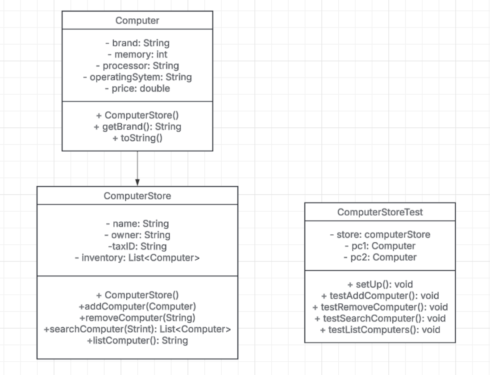

# Computer Store NortePC 🖥️


## Table of Contents

- Description
- Features
- Getting Started
  - Prerequisites
  - Installation
- Tests
- Build
- Usage
- Feedback and Contributions
- Contact

## 📌 Description

This project is a Java-based application that models a **computer shop**.
It allows users to manage a store's inventory, including adding, searching, and removing computers by brand.
The system follows **Test-Driven Development (TDD)** principles and ensures a **minimum test coverage of 70%**.

## 🚀 Features

✅ Add a new computer to the store.
✅ Delete a computer from the store by brand.
✅ Search for a computer by brand.
✅ List all computers in the store with full details.

## 🛠️ Technologies Used

- **Java** Development Kit (JDK) 21
- **Maven** (for build management)
- **JUnit 5** (for testing)
- **Git** (for version control)
- **Lucidchart** (See UML Diagram (here)[https://lucid.app/lucidchart/eb8dbeda-3f15-4ce3-8176-498fb57533a7/edit?viewport_loc=-195%2C587%2C1705%2C935%2CHWEp-vi-RSFO&invitationId=inv_0c7650ce-9677-446d-a289-2da21d6aa8ca])

## 🔍 UML Class Diagram
[Click here to view the UML Diagram](https://lucid.app/lucidchart/eb8dbeda-3f15-4ce3-8176-498fb57533a7/edit?viewport_loc=-195%2C587%2C1705%2C935%2CHWEp-vi-RSFO&invitationId=inv_0c7650ce-9677-446d-a289-2da21d6aa8ca)



## 🧪 Test-Driven Development (TDD)
The project implements **unit tests** using JUnit 5, ensuring robust test coverage.

📸 **Test Coverage Proof**


## Getting Started
### Installation

1. Clone the repository:
```Bash
git clone https://github.com/MabelRincon/computers-shop-java
```
2. Change to your project directory:
```bash
cd computers-shop-java
```
4. Run a clean Maven installation:
```Bash
mvn compile
mvn exec:java -Dexec.mainClass="dev.mabel.computer_shop.App"
```

## Tests Maven

```Bash
mvn test
```
**Example (using Maven):**

```Bash
mvn clean package
```
## Feedback and Contributions:

Feedback is welcome! Feel free to open issues or submit pull requests to suggest improvements or report any bugs.

## Contact:

I'm **Mabel Rincon** you can contact me via  [ LinkedIn](https://www.linkedin.com/in/mabel-rincon/)
&nbsp;
Check out other repositories at
&nbsp;
[ GitHub](https://github.com/MabelRincon)
